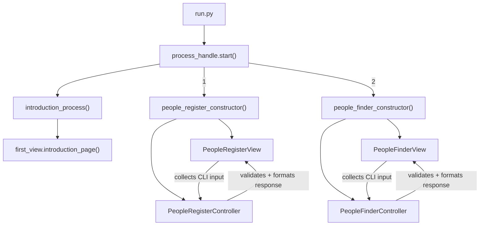

# Python MVC Pattern (Course Study)

This repository is a **study project for a course** demonstrating a simple **MVC (Model–View–Controller)** structure in Python using a terminal/CLI interface.

## How to run

From the `PythonMVCPattern/` folder:

```bash
python run.py
```

## Codebase structure (as implemented)

- **Entry point**: `run.py`
- **Main loop / routing**: `src/main/process_handle.py`
- **Composition (constructors)**: `src/main/constructor/`
  - `people_register_constructor.py`
  - `people_finder_constructor.py`
- **Controllers**: `src/controllers/`
  - `PeopleRegisterController`
  - `PeopleFinderController`
- **Views**: `src/views/`
  - CLI views that collect input (`input(...)`) and render output (`print(...)`)

## MVC flow

In this project, the “routing” happens in the `start()` loop (`process_handle.py`), which calls a constructor. The constructor wires a **View** + **Controller**, the view gathers user input, and the controller validates/formats a response that the view prints back.



## Notes

- **Views** are responsible for terminal I/O (clear screen, prompt, print).
- **Controllers** validate inputs and create a response payload.

